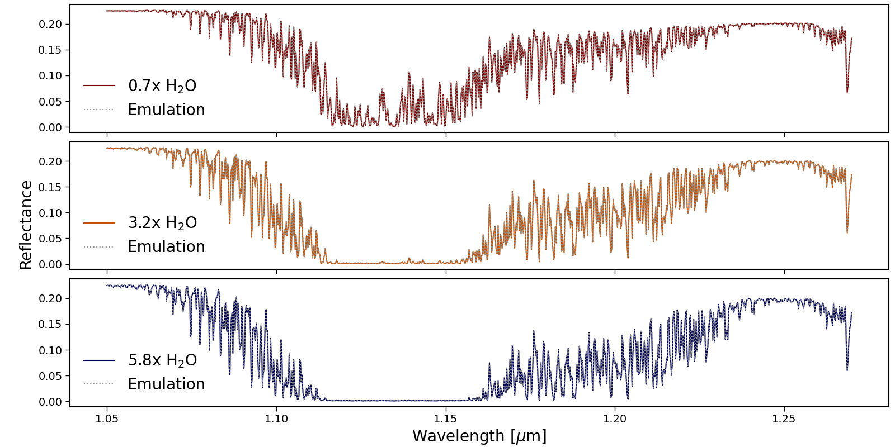

# DISORTEmulatePoC
This repository contains all the code and data used by the repo owner (Megan Gialluca) to produce a proof of concept (PoC) that illustrates the ability of a shallow neural network to correctly emulate the line-by-line radiative transfer code DISORT. 
Please note, this repository has not been created with the express intention of being used by other people, but rather the intention is to provide transparency for those who are interested in how I created this proof of concept. 
If further work into this area is funded in the future, it is my intention to build a tool that is usable for the general community. 

In this proof of concept, I constrain the scope of this emulation to be focused on fluxes produced in the 1.05 - 1.27 micron wavelength range for the clear-sky Earth's atmosphere in response to changing water concentrations (note the water absorption feature centered at 1.1 microns). Additionally, besides the model of the initial atmosphere, we do not allow photochemical or climate simulations to be rerun when changing the water VMR profile before calling DISORT to generate training data. This decision was primarily to conserve computation time, and lower the amount of training data necessary to produce a successful emulation test, as this is meant to only be a proof of concept for the computational method. When testing changing water concentrations, we explore a single multiplier to the VMR profile in the atmosphere (e.g., 1x, 2x, 3x, etc). 

In this Repo:
- `Create_Training_Dat.py` uses the Spectral Mapping Atmospheric Radiative Transfer (SMART) tool (Meadows & Crisp, 1996; Robinson, et al. 2011) as a wrapper to call DISORT (Stamnes, et al. 1988;2000) to generate training and testing data for the neural network. Training data is created for water VMR multipliers of 0.5 through 6 moving by steps of 0.5 (e.g., 1.5, 2, 2.5, 3, etc). Three testing cases are considered in this proof of concept for water VMR multipliers of 0.7, 3.2, and 5.8. All training and testing data is formatted into respective HD5 files to save storage space.
- `Train_Emulator.py` uses the previously generated training data to train a neural network built with the Keras API in TensorFlow (Chollet, et al. 2015). In this PoC, we use 1 input layer with 50 neurons, two hidden layers with 128 and 256 layers respectively, and 1 output layer with 200 neurons. All activation functions are Rectified Linear Unit (relu), the loss function is mean squared error (mse), and the optimizer is Adam.
- `Version1.keras` is the trained emulator created with the two previously described scripts.
- `Predict_on_Test_data.py` creates predictions with the trained emulator on the testing data.
- `Plot_Test.py` is all of the plotting scripts written to view the results of this PoC. All plots created are available and described below.
- `degrade_spec_demo.py` is a routine to degrade the resolution of a spectra, contributed by Dr. Tyler Robinson for plotting purposes in this PoC.

All of the results of the emulation test can be found in the `EmulationResults/` directory. In any naming cases, emulations 1, 2, and 3 correspond to the water VMR multiplier test cases of 0.7, 3.2, and 5.8 times, respectively. Here are the descriptions for the figures:
+ `SpectraCompare_linear_highres.png` gives the high (native) resolution reflectance spectrum of the water feature in each testing case from the DISORT solution compared to the emulator.
+ `SpectraCompare_linear_lowres.png` gives the lower resolution (R=5000) reflectance spectrum.
+ `UpDownFluxes_Emulation[1, 2, or 3].png` give heatmaps of the upwelling (flup) direct downwelling (fldir), and diffuse downwelling (fldiff) fluxes as a function of wavelength and atmospheric pressure from the DISORT solution and the emulator, as well as the difference between the two solutions.
+ `WaterVMREmulation[1, 2, or 3].png` give the neural networks attmempt to retrieve the vertical profile of the water mixing ratio in the atmosphere.

Overall, if you are just looking to see an overview of the performance of the emulator in this PoC, here is the comparison of the emulator to the DISORT solution for the low resolution reflectance spectra in all testing cases:

It can be seen that the emulator matches the DISORT solution very accurately, the mean squared error for emulations 1, 2, and 3 (0.7, 3.2, and 5.8 times the water VMR) is 5.4e-7, 4.0e-7, and 4.3e-7, respectively. 

## References
[1] Meadows, V. S., & Crisp, D. (1996). Journal of Geophysical Research: Planets, 101(E2), 4595-4622.
[2] Robinson, T. D., Meadows, V. S., Crisp, D., Deming, D., A'hearn, M. F., Charbonneau, D., ... & Wellnitz, D. D. (2011). Astrobiology, 11(5), 393-408.
[3] Stamnes, K., Tsay, S. C., Wiscombe, W., & Jayaweera, K. (1988). Applied optics, 27(12), 2502-2509.
[4] Stamnes, K., Tsay, S. C., Wiscombe, W., & Laszlo, I. (2000). DISORT, a general-purpose Fortran program for discrete-ordinate-method radiative transfer in scattering and emitting layered media: documentation of methodology.
[5] Chollet, Francois and others. (2015). https://keras.io/
